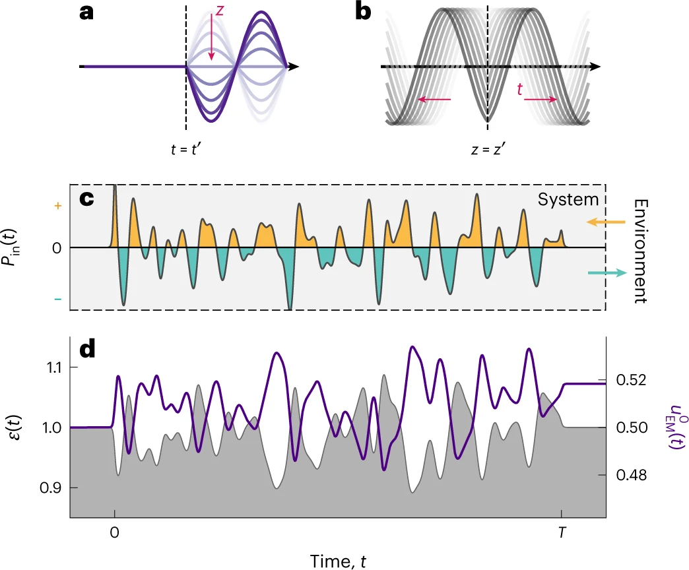

#### Research Articles

- **Photonic Systolic Array for All-Optical Matrix–Matrix Multiplication** \
Jungmin Kim, Qingyi Zhou, Zongfu Yu \
Laser & Photonics Reviews, e01995 (2025). [Publisher](https://doi.org/10.1002/lpor.202501995) [PDF](paper/lpr.pdf)
<!--  -->

- **Compute-First Optical Detection for Noise-Resilient Visual Perception** \
Jungmin Kim, Nanfang Yu & Zongfu Yu \
ACS Photonics 12, 1137-1145 (2025). [Publisher](https://doi.org/10.1021/acsphotonics.4c02284) [PDF](paper/acsphoton.pdf)
<!--  -->

- **Unidirectional scattering with spatial homogeneity using correlated photonic time disorder** \
Jungmin Kim, Dayeong Lee, Sunkyu Yu & Namkyoo Park \
Nature Physics 19, 726-732 (2023). [Publisher](https://doi.org/10.1038/s41567-023-01962-3) [PDF](paper/natphys.pdf)
<!--  -->

- **Topologically Protected All-Optical Memory** \
Seou Choi, Jungmin Kim, Jeonghun Kwak, Namkyoo Park & Sunkyu Yu \
Advanced Electronic Materials 8, 2200579 (2022). [Publisher](https://doi.org/10.1002/aelm.202200579) [PDF](paper/aem.pdf)
<!--  -->

- **Control of localization and optical properties with deep-subwavelength engineered disorder** \
Seunghwa Oh, Jungmin Kim, Xianji Piao, ..., & Namkyoo Park \
Optics Express 30, 28301-28311 (2022). [Publisher](https://doi.org/10.1364/OE.461766) [PDF](paper/oe.pdf)
<!--  -->

- **Machine-Engineered Active Disorder for Digital Photonics** \
Jungmin Kim, Seungkyun Park, Sunkyu Yu & Namkyoo Park \
Advanced Optical Materials 10, 2102642 (2022). [Publisher](https://doi.org/10.1002/adom.202102642) [PDF](paper/aom.pdf)
<!--  -->

- **Universal Design Platform for an Extended Class of Photonic Dirac Cones** \
Jungmin Kim, Sunkyu Yu & Namkyoo Park \
Physical Review Applied 13, 044015 (2020). [Publisher](https://doi.org/10.1103/PhysRevApplied.13.044015) [PDF](paper/prapplied.pdf) 
<!--  -->

---

#### Review Articles

- **Inverse design of nanophotonic devices enabled by optimization algorithms and deep learning: recent achievements and future prospects** \
Junhyeong Kim, Jae-Yong Kim, Jungmin Kim, ..., & Hamza Kurt \
Nanophotonics 14, 121-151 (2025). [Publisher](https://doi.org/10.1515/nanoph-2024-0536) [PDF](paper/nanoph2.pdf) 
<!--  -->

- **Hearing the shape of a drum for light: isospectrality in photonics** \
Seungkyun Park, Ikbeom Lee, Jungmin Kim, Namkyoo Park & Sunkyu Yu  \
Nanophotonics 11, 2763-2778 (2022). [Publisher](https://doi.org/10.1515/nanoph-2021-0614) [PDF](paper/nanoph1.pdf) 
<!--  -->

---
